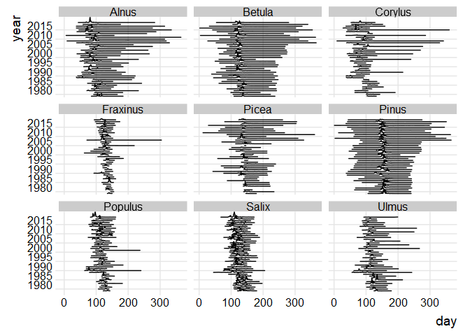
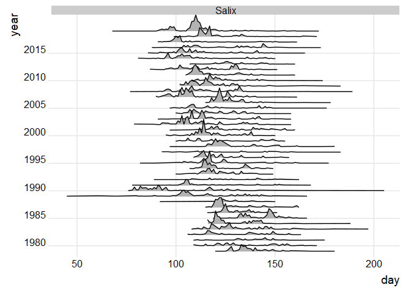
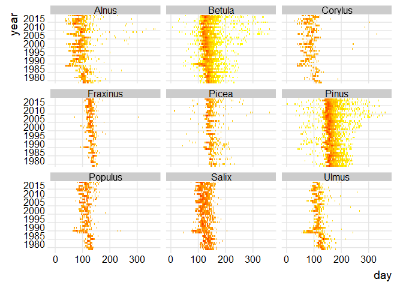
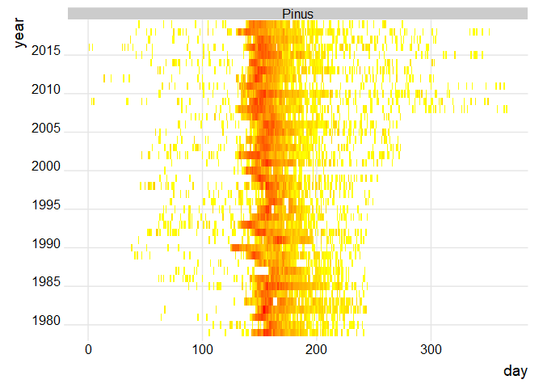
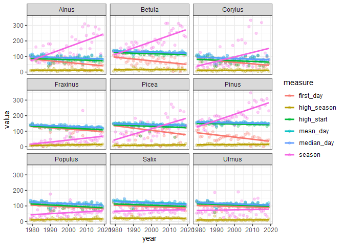
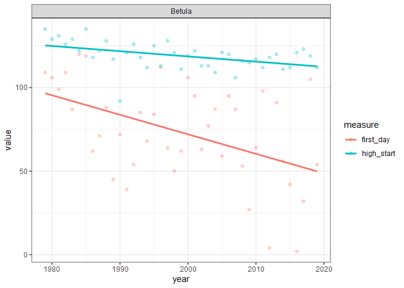
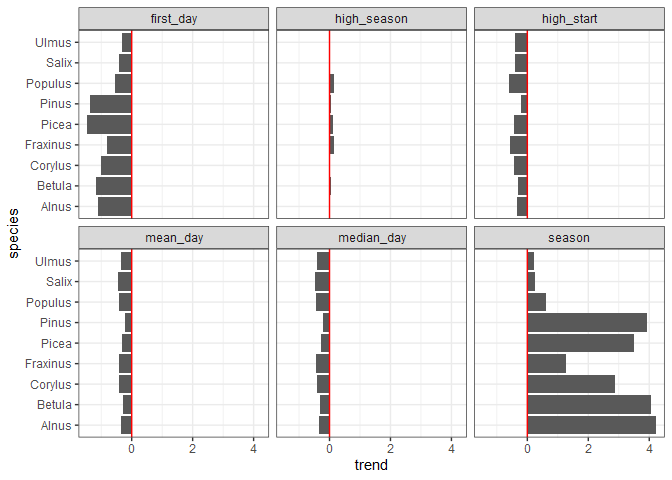

Pollentrender
================
Martin Sköld
2022-02-25

Läs in hjälpfunktioner och data för samtliga arter

``` r
library(tidyverse)
library(ggridges)
source("R/functions.R")
species <- c("Alnus", "Betula", "Salix", "Ulmus", "Fraxinus", "Populus", 
"Corylus", "Pinus", "Picea")
pollen_data <- read_pollen(species, file = "data/Pollen Stockholm dayly values 1979-2019.xlsx")
```

Illustrera med kurvor

``` r
ridge_plot(pollen_data, species)
```

<!-- -->

fokus på en art

``` r
ridge_plot(pollen_data, "Salix")
```

<!-- -->

Illustrera med färger

``` r
tile_plot(pollen_data, species)
```

<!-- -->

fokus på en art

``` r
tile_plot(pollen_data, "Pinus")
```

<!-- -->

Det ser ut som säsongen (kanske främst “lågsäsongen”) förlängts för
flera arter. De första 9-10 åren ser ut att ha en relativt sen
säsongsstart, vilket kan komma att slå igenom i trendanalyser. För att
göra trendanalyser beräknar vi ett antal sammanfattande mått på säsong

-   Första dagen (`first_day`).
-   Högsäsongens start (första dag då fler än 10% av säsongens maxvärde
    registrerats) (`high_start`)
-   Dagen med mest pollen (`max_day`)
-   “Medeldagen” (medelvärdet av dag på året över samtliga pollenkorn)
    (`mean_day`).
-   “Mediandagen” (den dag upp till vilken hälften av säsongens pollen
    räknats) (`median_day`).
-   Säsongens längd (första till sista pollenkorn) (`season`)
-   Högsäsongens längd (antal dagar med fler än 10% av säsongens
    maxvärde) (`high_season`)

Vi kan plotta dessa

``` r
pollen_seasons <- season_summaries(pollen_data, species)
measure <- c("first_day", "high_season", "high_start", "mean_day", "median_day", 
"season")
trend_plot(pollen_seasons, species, measure)
```

<!-- -->

eller enskilda

``` r
trend_plot(pollen_seasons, "Betula", c("high_start", "first_day"))
```

<!-- -->

Slutligen en illustration av trender och tabell. Trenden avser årlig
förändring i antal dagar, med ett P-värde mindre än det “magiska” 0.05
kan du kalla trenden “statistiskt signifkant” (på nivån 5%).

``` r
pollen_trends <- trend_table(pollen_seasons, species, measure)
pollen_trends %>% ggplot(aes(x = species, y = trend)) + 
  geom_col() + 
  facet_wrap(~measure) + 
  geom_hline(yintercept = 0, color = "red") +
  coord_flip() +
  theme_bw()
```

<!-- -->

``` r
knitr::kable(pollen_trends, digits = 2)
```

| species  | measure     |   mean | trend | p_value |
|:---------|:------------|-------:|------:|--------:|
| Alnus    | first_day   |  62.41 | -1.09 |    0.00 |
| Alnus    | high_season |  11.73 |  0.01 |    0.93 |
| Alnus    | high_start  |  80.05 | -0.35 |    0.15 |
| Alnus    | mean_day    |  91.70 | -0.33 |    0.09 |
| Alnus    | median_day  |  90.88 | -0.35 |    0.08 |
| Alnus    | season      | 157.24 |  4.22 |    0.00 |
| Betula   | first_day   |  73.22 | -1.17 |    0.00 |
| Betula   | high_season |  15.34 |  0.03 |    0.66 |
| Betula   | high_start  | 118.98 | -0.31 |    0.00 |
| Betula   | mean_day    | 128.93 | -0.28 |    0.00 |
| Betula   | median_day  | 127.41 | -0.33 |    0.00 |
| Betula   | season      | 190.44 |  4.04 |    0.00 |
| Corylus  | first_day   |  63.71 | -1.01 |    0.00 |
| Corylus  | high_season |  11.02 |  0.00 |    0.97 |
| Corylus  | high_start  |  73.05 | -0.43 |    0.12 |
| Corylus  | mean_day    |  87.96 | -0.41 |    0.06 |
| Corylus  | median_day  |  87.10 | -0.41 |    0.08 |
| Corylus  | season      |  94.41 |  2.87 |    0.01 |
| Fraxinus | first_day   | 114.46 | -0.82 |    0.00 |
| Fraxinus | high_season |  11.76 |  0.16 |    0.00 |
| Fraxinus | high_start  | 121.05 | -0.58 |    0.00 |
| Fraxinus | mean_day    | 131.53 | -0.41 |    0.00 |
| Fraxinus | median_day  | 131.27 | -0.43 |    0.00 |
| Fraxinus | season      |  41.76 |  1.28 |    0.01 |
| Picea    | first_day   | 106.98 | -1.46 |    0.00 |
| Picea    | high_season |  10.49 |  0.10 |    0.09 |
| Picea    | high_start  | 131.66 | -0.44 |    0.06 |
| Picea    | mean_day    | 144.12 | -0.32 |    0.00 |
| Picea    | median_day  | 142.10 | -0.28 |    0.00 |
| Picea    | season      | 112.17 |  3.50 |    0.00 |
| Pinus    | first_day   |  63.37 | -1.36 |    0.00 |
| Pinus    | high_season |  14.10 |  0.06 |    0.26 |
| Pinus    | high_start  | 146.39 | -0.21 |    0.03 |
| Pinus    | mean_day    | 154.71 | -0.21 |    0.02 |
| Pinus    | median_day  | 153.07 | -0.21 |    0.02 |
| Pinus    | season      | 204.68 |  3.92 |    0.00 |
| Populus  | first_day   |  94.61 | -0.55 |    0.00 |
| Populus  | high_season |  13.73 |  0.16 |    0.07 |
| Populus  | high_start  | 100.73 | -0.61 |    0.00 |
| Populus  | mean_day    | 115.39 | -0.43 |    0.00 |
| Populus  | median_day  | 114.76 | -0.46 |    0.00 |
| Populus  | season      |  56.10 |  0.63 |    0.12 |
| Salix    | first_day   |  96.32 | -0.43 |    0.03 |
| Salix    | high_season |  20.93 | -0.03 |    0.69 |
| Salix    | high_start  | 104.98 | -0.40 |    0.01 |
| Salix    | mean_day    | 122.19 | -0.46 |    0.00 |
| Salix    | median_day  | 118.49 | -0.47 |    0.00 |
| Salix    | season      |  71.05 |  0.25 |    0.37 |
| Ulmus    | first_day   |  96.59 | -0.33 |    0.12 |
| Ulmus    | high_season |  10.37 |  0.02 |    0.83 |
| Ulmus    | high_start  | 106.27 | -0.39 |    0.03 |
| Ulmus    | mean_day    | 113.44 | -0.36 |    0.01 |
| Ulmus    | median_day  | 112.78 | -0.41 |    0.00 |
| Ulmus    | season      |  74.83 |  0.20 |    0.71 |
